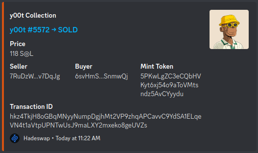

# solana-nft-sales-monitor

Monitor sales of Solana NFT Collections and sends corresponding notification to Discord.

Sales from the following marketplaces are supported.

- [Alpha Art](https://alpha.art)
- [Auction House](https://docs.metaplex.com/guides/auction-house/definition) (used by [OpenSea](https://opensea.io/) and [Fractal](https://www.fractal.is/))
- [Coral Cube](https://coralcube.io)
- [Digital Eyes](https://digitaleyes.market)
- [Exchange Art](https://exchange.art)
- [Hadeswap](https://www.hadeswap.com/)
- [Hyperspace](https://hyperspace.xyz)
- [Magiceden](https://magiceden.io)
- [Solana Monkey Business](https://market.solanamonkey.business)
- [Solanart](https://solanart.io)
- [Solport](https://solport.io)
- [Solsea](https://solsea.io)

Any other sales not from above marketplaces are classified as `Unknown`.

## Usage

Follow below steps to setup your NFT sales monitor.

### 1. Pre-requisite

There are few prerequisites for this application. You need to have `NodeJS` and `git` installed.

### 2. Get the application

Clone this repo and install its package dependencies.

```
git clone https://github.com/t4top/solana-nft-sales-monitor.git
cd solana-nft-sales-monitor
npm install
```

### 3. Setup the configuration parameters

The configuration file is `config.json`. It should be placed in the root folder of the repo. A sample [config.sample.json](config.sample.json) is provided as a reference.

Rename `config.sample.json` to `config.json` and add settings for your collections.

#### Configurable parameters

| Parameter   | Datatype | Required | Remark                                                                                                                                                                 |
| ----------- | -------- | -------- | ---------------------------------------------------------------------------------------------------------------------------------------------------------------------- |
| rpcEndpoint | string   | No       | Solana RPC endpoint e.g. https://api.mainnet-beta.solana.com                                                                                                           |
| collections | array    | Yes      | Array containing configuration settings for each `collection`. Each collection is an object with the parameters in below table. Multiple collections can be specified. |

#### Parameters for each `collection`

| Parameter      | Datatype | Required | Remark                                                                                                                    |
| -------------- | -------- | -------- | ------------------------------------------------------------------------------------------------------------------------- |
| name           | string   | Yes      | NFT collection name                                                                                                       |
| creatorAddress | string   | Yes      | Wallet address of one of the creators of the NFT collection. This application monitors this address for its transactions. |
| startAfterHash | string   | No       | Transaction hash after which the application will start to monitor NFT sales.                                             |
| discordWebhook | string   | No       | Webhook URL to the Discord channel where NFT sales notification will be posted.                                           |

### 4. Start the application

Run below command to start the application as a background service.

```
npm start
```

To stop the application, run below command.

```
npm stop
```

## Result

A sample Discord post is shown below. The embed content can be customized within [src/lib/discord.js](src/lib/discord.js).



## Buy me a coffee

Solana Wallet: [BFSi8WeoE2bLJtMUpB6KVggJZ4Uv5DavVrVsm5kdrQwY](solana:BFSi8WeoE2bLJtMUpB6KVggJZ4Uv5DavVrVsm5kdrQwY?label=Buy%20t4top%20a%20coffee&message=Thanks%20for%20your%20support&memo=Solana%20Pay)

## License

[GPL-3.0](./LICENSE)
